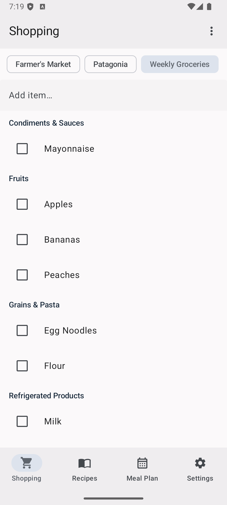
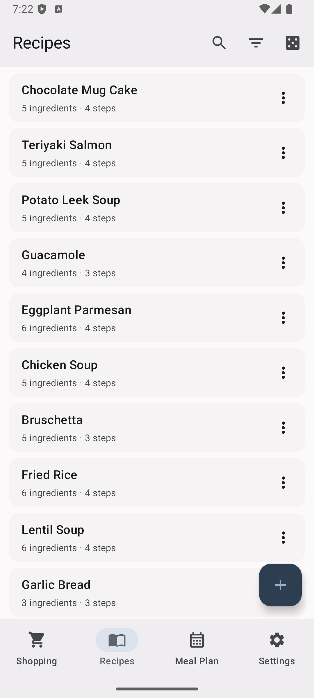
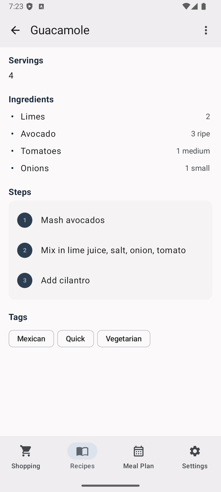
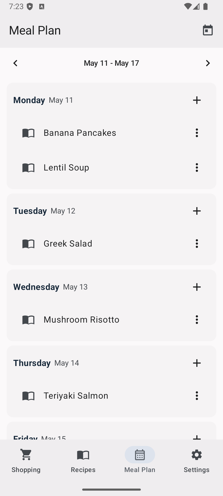
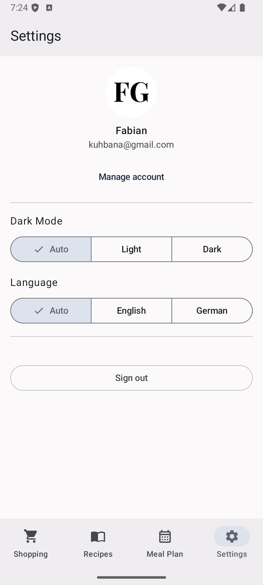

<div align="center">


[](https://github.com/fgrutsch/cookmaid/releases)
[](https://github.com/fgrutsch/cookmaid/actions/workflows/ci.yml?query=branch%3Amain)
[](https://codecov.io/gh/fgrutsch/cookmaid)
[](https://opensource.org/licenses/MIT)
</div>

Cookmaid is a self-hosted meal planning app. Manage your recipes, plan meals for the week,
and generate shopping lists — available on Android and as a Progressive Web App.

<p align="center">
  
  
  
  
  
</p>

See the [FAQ & Feature Guide](docs/faq.md) for usage tips and common workflows.

## Try It

The [`demo`](demo) directory contains a self-contained Docker Compose
setup with PostgreSQL, [Logto](https://logto.io/) (OIDC provider), and
Cookmaid — everything you need to try the app locally.

```shell
cd demo
docker compose up -d
```

1. Wait ~15 seconds for Logto to initialize and seed
2. Open http://localhost:3002 and complete the one-time Logto admin setup wizard
3. Open http://localhost:8081 and log in with `testuser` / `CookmaidTest2026!`

To stop everything: `docker compose down` (add `-v` to also remove data).


## Tech Stack

- Kotlin + Compose Multiplatform (Android, WasmJS)
- Ktor server (JVM)
- Exposed ORM + Flyway migrations on PostgreSQL
- Koin for DI, kotlinx.serialization + kotlinx.datetime
- OIDC auth via [Logto](https://logto.io/)

Pinned versions live in [`gradle/libs.versions.toml`](gradle/libs.versions.toml).

## Project Structure

- **`core/`** — Multiplatform library (Android, JVM, WasmJS). Data models
  and DTOs shared across client and server.
- **`app/shared/`** — Compose Multiplatform UI library (Android, WasmJS).
- **`app/webApp/`** — WasmJS application entry point. Progressive Web App
  (manifest, service worker, maskable icons).
- **`app/androidApp/`** — Android application entry point.
- **`server/`** — Ktor backend (JVM). Serves API + WasmJS static files.
- **`dev/`** — Docker Compose setup for local infrastructure
- **`docker/`** — Production Dockerfile + entrypoint

## Local Development Setup

### Prerequisites

- JDK 17+ (runtime container uses JDK 21)
- Docker & Docker Compose

### 1. Start Infrastructure

```shell
cd dev
docker compose up -d
```

This starts:
- **PostgreSQL** on port 5432 (databases: `cookmaid`, `logto`)
- **Logto** (OIDC provider) on http://localhost:3001 (admin console on http://localhost:3002)

A seed container automatically configures the Logto application, API
resource, sign-in experience, and a test user — no manual setup needed.

Log in with `testuser` / `CookmaidTest2026!`.
Logto admin console: http://localhost:3002 (one-time setup wizard on first use).

### 2. Configure local settings

Dev OIDC settings live in `dev/local.properties` (checked into version
control). These match the pre-seeded Logto environment.

The server reads its OIDC config from `application.yaml`. `oidc.issuer`
and `oidc.jwks-url` default to the local Logto instance;
`oidc.audience` defaults to the local API resource indicator.

### 3. Run

```shell
# Run server (port 8081)
./gradlew :server:run

# Run web app (Wasm, port 8080)
./gradlew :app:webApp:wasmJsBrowserDevelopmentRun

# Run Android app
./gradlew :app:androidApp:installDevDebug
```

### 4. Run Tests

```shell
# All tests
./gradlew test

# Per module
./gradlew :server:test
./gradlew :core:allTests
./gradlew :app:shared:allTests
```
